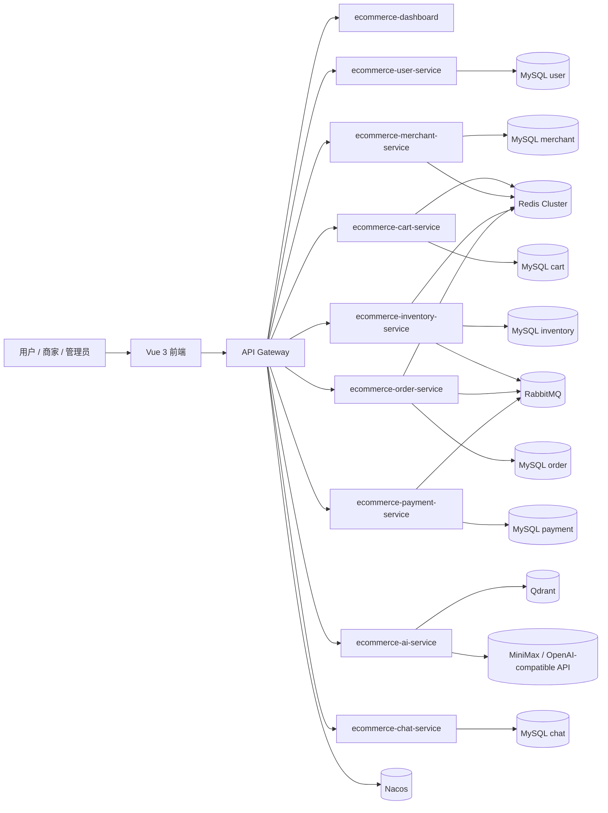
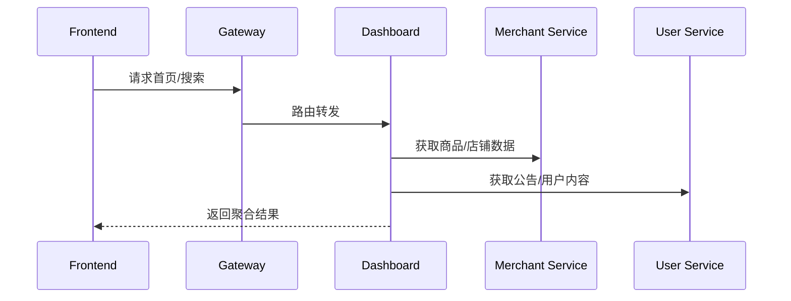
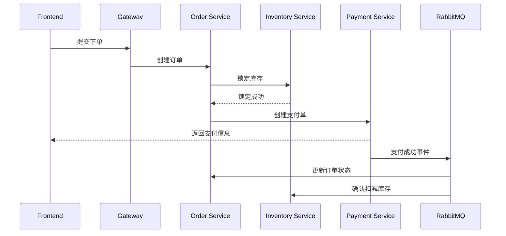
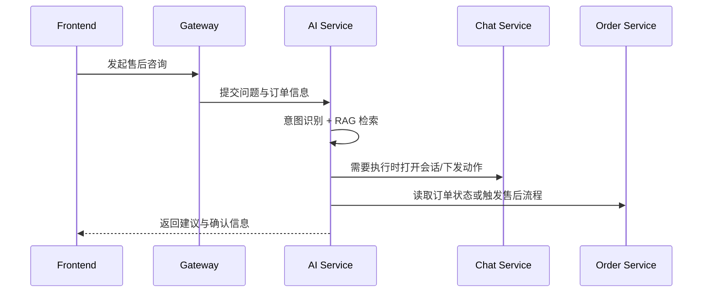
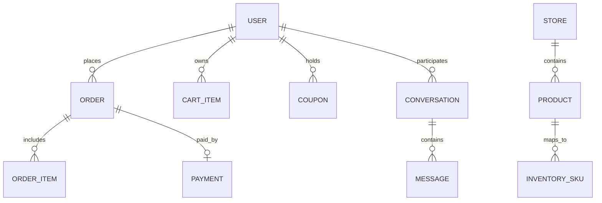

# AI导购与微服务电商系统系统设计说明书

> 说明：本文基于当前代码库与现有部署配置整理，部分容量、性能与可用性指标为行业常见场景下的合理假设，用于指导后续演进。

## 文档信息

- 课程：软件工程课程设计
- 文档阶段：概要设计 / 详细设计
- 编写人：Codex
- 完成日期：2026-05-22
- 适用范围：仅覆盖实验指导书中的系统设计阶段，不替代需求分析、实现、测试与项目总结等其他交付物。

## 与指导书对应关系

本说明书对应实验指导书中的“概要设计”“详细设计”部分，重点覆盖系统架构、模块职责、技术选型、核心流程、数据架构、接口规范、非功能性设计与部署运维。  
项目开发计划、需求分析、测试报告与项目总结应作为独立文档另行提交。

## 1. 项目背景与目标

本项目面向“商品浏览、下单支付、商家经营、售后咨询、AI导购”一体化场景，目标是将电商核心交易链路与 AI 能力解耦，通过微服务实现独立演进与弹性扩展。

设计目标：
- 支持高频商品检索、购物车、下单、支付、售后与客服咨询。
- 核心交易链路具备可水平扩展能力，支持向日均百万级订单演进。
- 核心服务可用性目标按 99.9% 设计，关键链路具备降级与兜底能力。

项目范围：
- 做：用户、商家、购物车、库存、订单、支付、聊天、AI 导购、首页聚合、网关统一接入。
- 不做：复杂分布式事务编排平台、全链路商业风控、跨区域多活、搜索引擎级商品检索平台。

## 2. 总体架构设计

系统采用“前后端分离 + API 网关 + 微服务 + 事件驱动”的组合架构。前端由 `ecommerce-frontend` 承担，后端通过 `ecommerce-gateway` 统一接入，各业务服务围绕领域边界独立部署。

架构选择理由：
- 微服务拆分能降低耦合，便于按业务域独立开发与扩容。
- 网关统一处理路由、CORS 与鉴权入口，降低前端接入复杂度。
- 事件驱动适合库存、支付、订单状态等异步协同场景，减少同步链路压力。

主要外部依赖：
- Nacos：服务发现与配置中心。
- MySQL：各业务服务独立持有数据。
- Redis Cluster：缓存、幂等、锁、热点数据。
- RabbitMQ：异步消息与削峰。
- Qdrant：AI 向量检索。
- MiniMax 兼容模型接口：AI 对话与 Embedding。

## 3. 模块划分与职责

| 模块 | 主要职责 | 通信方式 |
| --- | --- | --- |
| `ecommerce-gateway` | 统一入口、路由、跨域、负载均衡 | 转发 HTTP |
| `ecommerce-user-service` | 登录注册、账户、会员、优惠券、公告、后台管理 | HTTP |
| `ecommerce-merchant-service` | 商家入驻、店铺、商品、图片上传、商品评论 | HTTP + Redis + MQ |
| `ecommerce-dashboard` | 首页聚合、搜索、推荐、详情聚合 | HTTP + RestClient |
| `ecommerce-cart-service` | 购物车、行为记录、车内摘要 | HTTP + Redis |
| `ecommerce-inventory-service` | 库存调整、锁定、释放、确认 | HTTP + MQ + Redis |
| `ecommerce-order-service` | 订单创建、查询、发货、售后、统计 | HTTP + MQ + Redis |
| `ecommerce-payment-service` | 支付创建、查询、退款、模拟成功 | HTTP + MQ |
| `ecommerce-chat-service` | 会话、消息、售后沟通 | HTTP |
| `ecommerce-ai-service` | AI 导购、售后意图识别、RAG、图像检索 | HTTP + Qdrant + LLM |

核心交互关系：
- 前端所有业务流量统一进入网关，再路由到目标服务。
- 首页与搜索由 `dashboard` 聚合商家服务和用户内容服务的数据。
- 下单链路由订单服务、库存服务、支付服务协同完成，异步消息用于状态推进与补偿。
- AI 服务在售后场景下可联动聊天服务与订单服务，形成“识别 - 解释 - 执行”闭环。

## 4. 技术选型

| 领域 | 选型 | 依据 |
| --- | --- | --- |
| 后端语言 | Java 22 | 生态成熟，适合高并发服务开发 |
| 服务框架 | Spring Boot 3.3.4 | 标准化启动与组件集成能力强 |
| 微服务体系 | Spring Cloud 2023.0.3 | 网关、负载均衡、服务治理配套完整 |
| 配置/注册 | Nacos | 支持统一配置与服务发现 |
| 数据访问 | JPA + MyBatis | JPA 适合通用 CRUD，MyBatis 适合订单类复杂查询 |
| 缓存 | Redis Cluster | 支持高可用缓存、分布式锁与热点数据 |
| 消息队列 | RabbitMQ | 适合订单、库存、支付异步解耦 |
| 搜索/向量 | Qdrant | 适合 AI RAG 与图像语义检索 |
| AI 能力 | Spring AI + MiniMax 兼容接口 | 快速接入大模型与 Embedding 能力 |
| 前端 | Vue 3 + Vite + Axios | 轻量、开发效率高、适合 SPA |

## 5. 核心业务流程设计

### 5.1 首页浏览与搜索

处理策略：
- 首页与搜索采用聚合查询与默认兜底数据，避免单点内容源异常导致页面空白。
- 热门数据优先走缓存或轻量查询，降低高频读压力。

### 5.2 下单支付

处理策略：
- 库存先锁后扣，降低超卖风险。
- 支付回调与订单状态更新采用幂等设计，防止重复消息或重复提交。
- 超时未支付订单进入关闭流程，并释放库存占用。

### 5.3 售后与 AI 导购

处理策略：
- Qdrant 或外部模型不可用时，降级为规则化回答与人工引导。
- 外部 Embedding 调用失败时使用本地退化向量方案，保证核心链路可继续工作。

## 6. 数据架构设计

存储方案：
- MySQL 按服务独立拆库，避免跨服务直接 join。
- Redis Cluster 用于购物车、热点店铺/商品、分布式锁、幂等键和临时状态。
- RabbitMQ 用于订单创建、支付成功、库存确认、售后触发等异步事件。
- Qdrant 存储知识库向量与图像语义索引，服务 AI 检索。
- 文件上传落地到本地目录，当前用于用户头像、商家图片等对象。

核心数据流：
- 写请求首先进入对应业务服务。
- 业务服务完成校验、持久化和必要的缓存/消息写入。
- 异步事件驱动后续服务更新自身状态，最终形成一致视图。

## 7. 接口与集成规范

接口风格：
- 当前统一采用 RESTful 风格，路径前缀为 `/api/**`。
- 建议后续版本演进时引入 `/api/v1` 作为显式版本边界。

关键接口大纲：
- `/api/user/auth/*`：登录、注册、退出、当前用户。
- `/api/user/account/*`：个人资料、头像、密码。
- `/api/admin/*`：后台用户、公告、优惠券管理。
- `/api/merchant/*`：店铺、商品、上传、公开商品查询。
- `/api/cart/*`：购物车摘要、增删改、行为记录。
- `/api/inventory/*`：锁库、释放、确认、库存查询。
- `/api/order/*`：下单、订单详情、列表、发货、售后。
- `/api/payment/*`：支付创建、查询、退款。
- `/api/chat/*`：会话、消息、已读、售后动作。
- `/api/ai/*`：AI 导购与售后问答。
- `/api/home/*`：首页聚合、搜索、推荐、详情。

集成协议与鉴权：
- 服务间调用以 HTTP JSON 为主，文件上传使用 `multipart/form-data`。
- 内部服务发现与路由通过 Nacos + Gateway 完成。
- 统一鉴权采用 JWT，Token 通过 `Authorization` 头传递。
- 与外部 AI、Qdrant 的交互采用 REST 协议，使用 API Key 或等价鉴权方式。

## 8. 非功能性设计

性能目标：
- 首页、搜索、商品详情等读接口目标 `p95 < 200ms`。
- 下单接口目标 `p95 < 500ms`，支付创建接口 `p95 < 800ms`。
- AI 对话在外部模型正常可用时目标 `p95 < 3s`。

优化策略：
- 热点读数据缓存化，降低数据库直压。
- 下单与库存通过异步消息削峰。
- 读多写少的数据采用服务内缓存与 Redis。
- 订单、库存与支付采用幂等控制，减少重试副作用。

高可用设计：
- 服务无状态化，便于横向扩容。
- 网关与业务服务均可多实例部署。
- Redis Cluster、RabbitMQ 和 Nacos 提供基础设施级容错。
- 核心数据按服务独立备份，支持按库恢复。

安全策略：
- JWT 认证 + 基于角色的权限控制。
- 统一校验输入，防止 SQL 注入与非法参数穿透。
- 前端输出进行转义，降低 XSS 风险。
- 网关统一处理 CORS 与访问入口，生产环境应启用 HTTPS。
- 敏感配置通过 Nacos 或环境变量注入，不硬编码到代码仓库。

可扩展性：
- 新业务可按“独立服务 + 独立数据库 + 网关路由”方式接入。
- AI 能力、订单能力、售后能力均已预留异步协作空间，便于后续拆分演进。

## 9. 部署与运维概要

部署视图：
- 前端静态资源独立部署。
- 后端各微服务容器化部署，通过 Nacos 注册发现。
- 基础设施建议采用 Docker 或容器编排管理，当前仓库已提供 Redis、RabbitMQ、Qdrant 等本地化支撑目录。

运维体系：
- 监控：Spring Boot Actuator 暴露健康检查与基础指标。
- 日志：各服务写入本地/容器日志，统一纳入日志平台。
- 告警：基于健康检查、错误率、消息堆积、数据库连接与 Redis 可用性设置告警。
- 配置管理：Nacos 承担公共配置和服务专属配置管理。

---

结论：本系统以“微服务拆分 + AI 增强 + 统一网关”为主线，兼顾可演进性与课程实训交付要求，适合作为中型电商平台的顶层设计基线。
