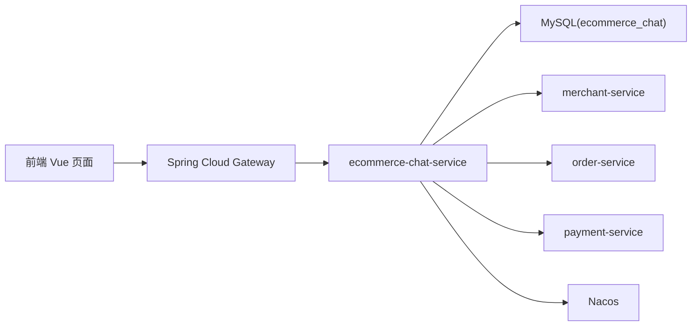

# 电商网站 Chat 模块技术实现分析

> 说明：本文只梳理普通 `chat` 模块，不包含 `AI` 客服能力，不分析 `ecommerce-ai-service`、`AiChatDrawer.vue`、`/api/ai/**`。

## 1. 模块定位

本项目里的 Chat 模块，本质上不是“泛社交聊天”，而是一个围绕电商交易流程设计的**业务会话系统**。它主要承担三类职责：

1. 买家在商品页、店铺页发起咨询，与店铺侧进行普通客服沟通。
2. 买家或商家围绕某个订单发起售后会话，沉淀售后处理过程。
3. 当售后升级时，允许管理员加入会话并执行强制取消、强制退款等动作。

所以，这个模块的核心价值不是“即时通讯技术炫技”，而是把**商品、店铺、订单、售后状态、消息流**统一在一个业务会话里。

## 2. 模块边界

### 2.1 本文覆盖范围

- 前端聊天页面与入口
- 网关路由
- `ecommerce-chat-service`
- 聊天服务依赖的商家、订单、支付接口
- 会话表、消息表
- 普通咨询会话与售后会话

### 2.2 本文不覆盖

- `AI` 客服对话
- 图片识别、RAG、向量检索
- `ecommerce-ai-service`

## 3. 总体架构

Chat 模块采用的是**前后端分离 + 微服务**架构。



可以把它理解为：

- 前端只负责会话展示、消息发送、按钮控制。
- 网关负责统一入口转发。
- `chat-service` 负责真正的业务规则。
- `merchant-service` 提供店铺/商品信息校验。
- `order-service` 提供订单明细和售后状态同步。
- `payment-service` 只在管理员强制退款时参与。

## 4. 技术栈

### 4.1 前端

- `Vue 3`
- `Vue Router 4`
- `Axios`
- `Vite`

对应文件：

- `ecommerce-frontend/package.json`
- `ecommerce-frontend/src/router/index.js`
- `ecommerce-frontend/src/services/chat.js`
- `ecommerce-frontend/src/views/ChatView.vue`

### 4.2 后端

- `Spring Boot 3.3.4`
- `Spring Web`
- `Spring Security`
- `Spring Data JPA`
- `MySQL`
- `Spring Cloud Gateway`
- `Nacos` 注册与配置中心

对应文件：

- `pom.xml`
- `ecommerce-chat-service/pom.xml`
- `ecommerce-gateway/src/main/resources/application.yml`
- `ecommerce-chat-service/src/main/resources/application.yml`

## 5. 前端结构梳理

## 5.1 路由入口

聊天页路由定义在：

- `ecommerce-frontend/src/router/index.js`

核心路由：

```js
{ path: '/chat', component: ChatView, meta: { requiresAuth: true } }
```

这说明 `/chat` 是一个**受登录保护的业务页面**，未登录无法访问。

## 5.2 前端服务层

聊天请求统一封装在：

- `ecommerce-frontend/src/services/chat.js`

它封装了 7 个核心接口：

1. `openChatConversation`
2. `openAfterSaleConversation`
3. `fetchChatConversations`
4. `fetchChatMessages`
5. `sendChatMessage`
6. `markChatConversationRead`
7. `applyAfterSaleChatAction`

这里的设计比较标准：**页面不直接拼接接口，而是通过 service 层统一管理**，方便后续维护。

## 5.3 聊天页面 `ChatView.vue`

聊天模块的前端核心页面是：

- `ecommerce-frontend/src/views/ChatView.vue`

它承担了 4 个角色：

1. 会话列表展示
2. 当前会话消息展示
3. 消息发送
4. 售后操作面板展示

### 关键状态

`ChatView.vue` 维护了这些核心状态：

- `conversations`：会话列表
- `messages`：当前消息列表
- `currentConversation`：当前选中的会话
- `draftText`：输入框文本
- `draftProduct` / `draftStore`：上下文商品和店铺
- `remarkDialogVisible`：售后备注弹窗
- `actionRunning`：售后动作执行中状态

### 关键查询参数

聊天页不是单一入口，而是根据 URL 参数进入不同模式：

- `storeId`：发起普通店铺会话
- `productId`：发起与某商品有关的会话
- `conversationId`：直接打开已有会话
- `afterSaleOrderNo`：发起售后会话
- `afterSaleStoreId`：指定售后对应店铺
- `source`：会话来源，如商品页、店铺页
- `mode`：界面提示模式，如商家视角、管理员视角

需要强调一点：

`mode=merchant` 或 `mode=admin` **主要影响界面文案**，真正能看到什么会话、能做什么操作，还是由后端鉴权决定。

## 5.4 前端消息展示

前端根据 `messageType` 做分支渲染：

- `TEXT`：普通文本
- `PRODUCT_CARD`：商品卡片
- `AFTER_SALE_ACTION`：售后动作消息
- `SYSTEM_NOTICE`：系统通知消息

这说明前端并不是把所有消息都当纯文本，而是做了**结构化消息渲染**。

## 5.5 前端售后操作

当前会话如果是售后会话，页面会展示：

- 售后状态文案
- 售后流程时间线
- 可执行动作按钮

例如：

- 买家可申请退货、换货、申请管理员介入
- 商家可同意退货、同意换货、拒绝申请
- 管理员可进入会话、强制取消、强制退款

但这里有一个很重要的实现特征：

- 后端返回 `availableActions`
- 前端再通过 `afterSaleActionState()` 根据当前状态做按钮禁用判断

也就是说，**状态约束是“后端给动作集合 + 前端做细粒度禁用”**，这会影响后面我们对优化点的分析。

## 6. 前端入口全景

Chat 模块在前端并不是孤立页面，而是嵌入多个业务页面。

## 6.1 商品详情页入口

文件：

- `ecommerce-frontend/src/views/ProductDetailView.vue`

买家点击“联系客服”后跳转：

```js
router.push({
  path: '/chat',
  query: {
    storeId: detail.value.product.storeId,
    productId: detail.value.product.id,
    source: 'product-detail'
  }
});
```

意义：

- 进入聊天时自动带上商品上下文
- 后续可以直接发送商品卡片给商家

## 6.2 店铺详情页入口

文件：

- `ecommerce-frontend/src/views/StoreDetailView.vue`

有两种入口：

1. 直接联系店铺客服
2. 围绕店铺内某个商品咨询

这使得店铺页既能发起“店铺维度”咨询，也能发起“商品维度”咨询。

## 6.3 订单详情页入口

文件：

- `ecommerce-frontend/src/views/OrderDetailView.vue`

这里的作用主要是售后：

1. 用户点击申请售后
2. 订单服务先把订单切到售后状态
3. 再调用 `openAfterSaleConversation`
4. 最终跳到 `/chat?conversationId=xxx`

所以，聊天页是**售后处理的承载页面**，而不是售后申请的唯一入口。

## 6.4 商家中心入口

文件：

- `ecommerce-frontend/src/views/MerchantCenterView.vue`

商家端有两种相关入口：

1. 直接进入 `/chat?mode=merchant` 查看消息
2. 从订单列表打开某个售后会话

这说明商家聊天不是单独后台，而是复用同一个聊天页面。

## 6.5 首页入口

文件：

- `ecommerce-frontend/src/views/HomeView.vue`

首页承担两个作用：

1. 通过 `fetchChatConversations()` 拉取会话列表，生成未读提醒
2. 支持用户从首页直接跳到最近会话

另外管理员在首页导航可以直接进入：

```text
/chat?mode=admin
```

这相当于管理员的售后会话入口。

## 7. 网关与服务边界

网关配置文件：

- `ecommerce-gateway/src/main/resources/application.yml`

聊天模块对应路由：

```yaml
- id: chat-service
  uri: lb://ecommerce-chat-service
  predicates:
    - Path=/api/chat/**
```

这说明：

- 前端永远访问 `/api/chat/**`
- 网关再把请求转发给 `ecommerce-chat-service`
- 服务发现通过 `Nacos`

这种设计的好处是：

1. 前端不需要关心聊天服务端口
2. 各服务可以独立部署
3. 路由和跨域策略集中在网关管理

## 8. 后端结构梳理

`ecommerce-chat-service` 是聊天模块的核心后端服务。

### 8.1 分层结构

可以概括为：

```text
controller -> service -> repository -> database
                     -> client -> other services
```

对应主要文件：

- `controller/ChatController.java`
- `service/ChatConversationService.java`
- `repository/ChatConversationRepository.java`
- `repository/ChatMessageRepository.java`
- `domain/ChatConversation.java`
- `domain/ChatMessage.java`

## 8.2 控制器层

控制器文件：

- `ecommerce-chat-service/src/main/java/org/example/chat/controller/ChatController.java`

暴露的核心接口如下：

| 接口 | 方法 | 作用 |
| --- | --- | --- |
| `/api/chat/conversations/open` | `POST` | 打开普通会话 |
| `/api/chat/conversations/open-after-sale` | `POST` | 打开售后会话 |
| `/api/chat/conversations` | `GET` | 获取当前用户可见会话列表 |
| `/api/chat/conversations/{id}` | `GET` | 查看某会话详情 |
| `/api/chat/conversations/{id}/messages` | `GET` | 获取消息列表 |
| `/api/chat/conversations/{id}/messages` | `POST` | 发送消息 |
| `/api/chat/conversations/{id}/read` | `POST` | 标记已读 |
| `/api/chat/conversations/{id}/after-sale/action` | `POST` | 执行售后动作 |

特点：

- 所有接口都先从 `Authentication` 中取 `AuthenticatedUser`
- 控制器本身很薄
- 业务基本都下沉到了 `ChatConversationService`

这属于比较典型的“薄控制器、厚服务层”风格。

## 8.3 服务层

服务文件：

- `ecommerce-chat-service/src/main/java/org/example/chat/service/ChatConversationService.java`

这是整个聊天模块的“业务中枢”，主要负责：

1. 创建或复用普通会话
2. 创建或复用售后会话
3. 组装会话列表视图
4. 组装消息列表视图
5. 发送消息
6. 维护未读数
7. 处理售后动作
8. 调用订单/支付/商家服务

## 8.4 仓储层

仓储文件：

- `ChatConversationRepository.java`
- `ChatMessageRepository.java`

仓储层职责很清晰：

- 会话表：按买家、商家、管理员、业务类型查询会话
- 消息表：按会话查询消息、按 `clientMsgId` 做幂等去重

## 8.5 实体层

实体文件：

- `domain/ChatConversation.java`
- `domain/ChatMessage.java`
- `domain/MessageType.java`
- `domain/ConversationStatus.java`

其中 `MessageType` 定义了 4 类消息：

- `TEXT`
- `PRODUCT_CARD`
- `AFTER_SALE_ACTION`
- `SYSTEM_NOTICE`

## 9. 安全与权限设计

安全相关文件：

- `security/SecurityConfig.java`
- `security/TokenAuthenticationFilter.java`
- `security/TokenService.java`
- `security/AuthenticatedUser.java`

## 9.1 基础安全策略

聊天服务开启了无状态认证：

- 禁用 Session
- 所有非 `actuator` 接口都必须认证
- 通过 `Authorization: Bearer <token>` 解析当前用户

## 9.2 Token 解析

`TokenService.java` 会：

1. 校验签名
2. 校验过期时间
3. 解析出：
   - `userId`
   - `username`
   - `nickname`
   - `role`
   - `permissions`
   - `points`
   - `memberLevel`

说明这个项目不是用标准 JWT 库，而是自定义了一个轻量 token 解析机制。

## 9.3 权限控制核心思想

Chat 模块真正的权限控制不是简单看“是不是商家角色”，而是看：

- 当前用户是否等于 `buyerUserId`
- 当前用户是否等于 `merchantUserId`
- 当前用户是否是管理员，且是否满足管理员接入条件

这点非常重要：

### 本项目的“商家侧身份”是业务身份，不完全等于 token 角色

`ecommerce-chat-service` 的 `UserRole` 只有：

- `USER`
- `ADMIN`

并没有单独的 `MERCHANT` 枚举。

所以，商家能以“商家侧”进入会话，不是因为 token 里有 `MERCHANT`，而是因为：

1. 会话里存了 `merchantUserId`
2. 当前登录用户的 `userId` 恰好等于这个 `merchantUserId`

这是一种**基于业务归属的会话权限模型**。

## 10. 数据库设计

表结构文件：

- `ecommerce-chat-service/src/main/resources/schema.sql`

## 10.1 会话表 `chat_conversation`

这个表保存的是“一个会话的整体状态”，不是单条消息。

核心字段可以分成 6 组：

### 1. 会话身份

- `id`
- `conversation_key`
- `biz_type`
- `status`

### 2. 店铺信息

- `store_id`
- `store_title`
- `store_image_url`

### 3. 会话双方

- `buyer_user_id`
- `buyer_username`
- `buyer_nickname`
- `merchant_user_id`
- `merchant_username`
- `merchant_nickname`

### 4. 售后扩展

- `order_no`
- `after_sale_status`
- `admin_joined`
- `admin_user_id`
- `admin_nickname`

### 5. 商品快照

- `product_id`
- `product_title`
- `product_image_url`
- `product_description`
- `product_price`

### 6. 会话摘要

- `last_message_type`
- `last_message_text`
- `last_message_at`
- `buyer_unread_count`
- `merchant_unread_count`
- `admin_unread_count`

这个设计很典型：**会话表不是只存关系，而是把列表页需要的信息提前冗余进去**，这样查会话列表时就不用每次再 join 多张表。

## 10.2 会话唯一键设计

普通会话和售后会话采用了不同的 `conversation_key`：

### 普通咨询会话

```text
storeId:userId
```

例如：

```text
12:10001
```

表示“用户 10001 和店铺 12 的普通会话”。

这意味着：

- 同一用户针对同一店铺的普通咨询会话会被复用
- 不会每点一次“联系客服”就新建一个会话

### 售后会话

```text
AFTER_SALE:orderNo:storeId
```

例如：

```text
AFTER_SALE:SO202605130001:12
```

表示“某订单在某店铺维度下的售后会话”。

这保证了售后会话天然与订单绑定。

## 10.3 消息表 `chat_message`

这个表保存的是单条消息。

关键字段：

- `conversation_id`
- `sender_user_id`
- `sender_role`
- `sender_nickname`
- `client_msg_id`
- `message_type`
- `content`
- `payload_json`
- `created_at`

其中最值得讲的是两个点：

### `client_msg_id`

这个字段和 `(conversation_id, client_msg_id)` 唯一索引一起构成了**消息幂等**。

前端每发一条消息都会生成一个唯一客户端消息 ID，后端如果发现这个 ID 已存在，就直接返回旧消息，而不是重复插入。

### `payload_json`

这个字段支持结构化消息内容，比如商品卡片：

- 商品 ID
- 商品标题
- 商品图片
- 商品价格
- 店铺信息

这比只存纯文本更灵活。

## 11. 普通咨询会话核心流程

## 11.1 打开会话

普通咨询会话通过：

```text
POST /api/chat/conversations/open
```

完成。

服务层流程如下：

1. 校验 `storeId` 必填
2. 调用 `merchant-service` 查询店铺
3. 取出店主 `ownerUserId`
4. 判断当前用户不能咨询自己的店铺
5. 如果传了 `productId`，再校验商品存在且属于该店铺
6. 生成 `conversation_key = storeId:userId`
7. 如果已有会话则复用，没有就创建
8. 返回会话视图给前端

### 为什么要先查商家服务？

因为聊天服务自己不保存完整商品目录，只保存会话快照。  
所以在创建会话那一刻，它必须先去商家服务确认：

- 店铺是否真实存在
- 商品是否真实存在
- 商品是否属于该店铺
- 店铺归属哪个商家

## 11.2 会话创建时的初始状态

普通会话创建后：

- `bizType = SHOP_SUPPORT`
- `status = ACTIVE`
- `buyerUnreadCount = 0`
- `merchantUnreadCount = 1`
- `lastMessageText = "会话已创建"`

这说明从业务上看：

- 会话是由买家先发起
- 因此默认商家侧有一个待处理提醒

## 11.3 发送文本消息

发送文本消息接口：

```text
POST /api/chat/conversations/{id}/messages
```

发送流程：

1. 校验当前用户能访问该会话
2. 识别当前用户是买家侧、商家侧还是管理员侧
3. 校验 `clientMsgId`
4. 校验 `messageType`
5. 文本消息必须有 `content`
6. 根据 `conversationId + clientMsgId` 去重
7. 保存消息
8. 更新会话摘要和未读数

## 11.4 商品卡片消息

商品卡片消息也是走同一个发消息接口，只是：

- `messageType = PRODUCT_CARD`
- `payloadJson` 中存结构化商品信息

前端在商品详情页进入聊天后，可以把当前商品作为卡片发给商家。这样商家看到的不是一句模糊文字，而是明确的商品上下文。

这属于很实用的电商业务设计。

## 12. 售后会话核心流程

售后会话是 Chat 模块最有业务价值的部分。

## 12.1 售后会话创建

接口：

```text
POST /api/chat/conversations/open-after-sale
```

服务层流程：

1. 校验 `orderNo`
2. 调用 `order-service` 拉取订单详情
3. 读取订单中的买家 ID 和订单商品项
4. 根据 `storeId` 选出本次售后对应的那家店铺商品
5. 调用 `merchant-service` 查询店铺和店主
6. 判断当前用户是否是买家、商家或管理员
7. 生成 `conversation_key = AFTER_SALE:orderNo:storeId`
8. 创建或复用售后会话

这一步本质上是把：

- 订单
- 店铺
- 买家
- 商家
- 商品快照

统一绑定到了一个可持续追踪的售后会话上。

## 12.2 售后会话的初始状态

创建时：

- `bizType = AFTER_SALE`
- `afterSaleStatus = PENDING`
- `sourceType = after-sale`
- `lastMessageType = SYSTEM_NOTICE`
- `lastMessageText = "售后会话已创建"`

如果是买家先打开，默认商家有未读。  
如果是商家先打开，默认买家有未读。

## 12.3 售后动作列表

后端会根据当前用户在会话中的身份，返回 `availableActions`：

### 买家侧

- `APPLY_RETURN`
- `APPLY_EXCHANGE`
- `REQUEST_ADMIN_INTERVENTION`

### 商家侧

- `MERCHANT_APPROVE_RETURN`
- `MERCHANT_APPROVE_EXCHANGE`
- `MERCHANT_REJECT`

### 管理员侧

- 未加入时：`ADMIN_JOIN`
- 已加入时：`ADMIN_FORCE_CANCEL`、`ADMIN_FORCE_REFUND`

前端再根据当前 `afterSaleStatus` 对按钮做禁用控制和提示。

## 12.4 售后动作执行链路

接口：

```text
POST /api/chat/conversations/{id}/after-sale/action
```

买家、商家、管理员都通过这个统一接口执行不同操作。

### 买家动作

- 申请退货
- 申请换货
- 申请管理员介入

### 商家动作

- 同意退货
- 同意换货
- 拒绝申请

### 管理员动作

- 进入会话
- 强制取消售后
- 强制退款

## 12.5 与订单服务、支付服务的联动

售后动作不是只改聊天表，还会触发外部服务：

### 买家申请退货/换货

聊天服务会调用：

```text
POST /api/order/orders/{orderNo}/after-sale
```

作用是让订单服务进入售后状态。

### 管理员强制取消售后

聊天服务会调用：

```text
POST /api/order/internal/orders/{orderNo}/after-sale/force-cancel
```

### 管理员强制退款

先调用支付服务：

```text
POST /api/payment/admin/refund/by-order?orderNo=...
```

再调用订单服务：

```text
POST /api/order/internal/orders/{orderNo}/after-sale/force-refund
```

这说明管理员动作不是“聊天页面上的装饰按钮”，而是真正能驱动交易状态变化。

## 13. 管理员介入逻辑

管理员的权限比较特殊。

### 13.1 管理员何时能看到会话

管理员不是默认能看到所有会话，而是主要能看到：

1. 自己已经加入的售后会话
2. `AFTER_SALE` 且 `afterSaleStatus = ADMIN_REQUESTED` 的待介入会话

这体现了一个思路：

- 普通买家和商家会话由双方自己处理
- 只有升级后的售后争议才暴露给管理员

### 13.2 管理员进入会话

管理员执行 `ADMIN_JOIN` 后：

- `adminJoined = true`
- `adminUserId = 当前管理员`
- `adminNickname = 当前管理员昵称`

同时系统会插入一条 `SYSTEM_NOTICE`，表明管理员已进入会话。

## 14. 会话列表与未读数机制

## 14.1 未读数维护

后端为三种身份分别维护未读：

- `buyerUnreadCount`
- `merchantUnreadCount`
- `adminUnreadCount`

消息发送后：

- 买家发送 -> 商家未读 +1，若管理员已加入则管理员未读 +1
- 商家发送 -> 买家未读 +1，若管理员已加入则管理员未读 +1
- 管理员发送 -> 买家未读 +1，商家未读 +1，管理员未读归零

## 14.2 已读机制

前端加载消息后，会立即调用：

```text
POST /api/chat/conversations/{id}/read
```

后端再按当前身份把自己的未读数清零。

## 14.3 首页消息提醒

首页会定时调用 `fetchChatConversations()`，把会话列表中当前用户自己的未读数汇总，形成消息红点和最近会话提醒。

这说明 Chat 模块已经被集成进首页通知体系，而不是孤立存在。

## 15. 幂等性与数据一致性设计

这个模块有两个比较好的工程点。

## 15.1 会话幂等

无论普通会话还是售后会话，都不是每次点击都新建，而是通过 `conversation_key` 保证复用。

即使并发情况下出现唯一键冲突，代码里也通过：

- 先 `save`
- 异常时再 `findByConversationKey`

实现了兜底。

## 15.2 消息幂等

通过 `clientMsgId` 保证同一条消息不会重复插入。

这是典型的“前端重试安全设计”，在网络抖动场景下非常重要。

## 15.3 会话摘要冗余

每次发消息都会同步更新：

- `lastMessageType`
- `lastMessageText`
- `lastMessageAt`

好处是会话列表页不需要每次再去查“最后一条消息”。

## 16. 关键业务设计亮点

如果答辩时要总结这个模块，可以重点讲下面 5 点。

### 1. 它不是单纯聊天，而是业务会话

会话里天然携带：

- 店铺信息
- 商品快照
- 订单号
- 售后状态
- 管理员介入状态

所以它是“沟通系统 + 业务状态系统”。

### 2. 普通咨询与售后会话分层清晰

通过 `bizType` 区分：

- `SHOP_SUPPORT`
- `AFTER_SALE`

这让两个场景在同一套基础设施下复用，但业务又不会混乱。

### 3. 结构化消息设计合理

不是只有文本，还支持商品卡片、系统通知、售后动作消息。

### 4. 微服务边界明确

聊天服务不自己维护商品目录、订单状态、支付退款，而是通过接口调用其他服务完成。

### 5. 已具备基础工程意识

包括：

- 统一网关入口
- 统一鉴权
- 幂等设计
- 未读数设计
- 列表页摘要冗余

## 17. 当前实现的局限与优化方向

这一部分很适合答辩时主动讲，能体现你不是只会“描述现状”，而是理解系统演进。

## 17.1 没有实时推送

当前 Chat 模块没有用 WebSocket、SSE 或 MQ 推送到前端。

现状是：

- 首页会定时拉取会话列表
- 聊天页主要在进入页面、切换会话、发送消息后刷新

所以它更接近“准实时业务聊天”，而不是真正 IM。

### 可优化方向

- 增加 WebSocket
- 会话列表和消息列表都做实时推送

## 17.2 售后状态机校验偏分散

当前实现里：

- 后端负责按身份返回 `availableActions`
- 前端再按当前售后状态做按钮禁用

但后端 `applyAfterSaleAction()` 对“状态是否合法流转”的校验不够强，更多是按角色判断。

换句话说：

- 当前版本更依赖前端控制按钮
- 如果有人绕过前端直接调接口，后端状态机还可以更严谨

### 可优化方向

- 在后端补完整状态机校验
- 明确“某状态下允许哪些动作”
- 把状态流转规则从前端回收到后端

这是当前模块最值得继续完善的一点。

## 17.3 管理员强制动作的后端约束还可以更严

前端要求管理员先 `ADMIN_JOIN`，再允许强制取消/强制退款。  
但后端的强制动作判断主要基于管理员身份，约束还可以更细。

### 可优化方向

- 强制动作前明确校验 `adminJoined == true`
- 校验当前管理员就是已加入该会话的管理员

## 17.4 消息和会话没有分页

当前：

- 会话列表一次性查全量
- 消息列表一次性查全量

当聊天记录很多时，会影响性能。

### 可优化方向

- 会话列表分页
- 消息按游标或时间分页
- 前端增量加载历史消息

## 17.5 DTO 类型化不足

当前控制器和服务层大量使用：

```java
Map<String, Object>
```

优点是开发快，灵活。  
缺点是：

- 类型安全弱
- 维护成本高
- 文档生成能力弱

### 可优化方向

- 引入明确的 `ConversationVO`、`MessageVO`
- 引入 `OpenConversationResponse` 等 DTO

## 17.6 测试覆盖不足

在当前仓库里，没有发现：

- `ecommerce-chat-service/src/test/...`

这说明聊天服务的自动化测试覆盖明显不足。

### 可优化方向

- 增加服务层单元测试
- 增加接口层集成测试
- 增加售后状态流转测试
- 增加权限测试、幂等测试

## 18. 答辩时可以这样概括

如果老师让你用 1 分钟概括 Chat 模块，可以这样说：

> 我们的 Chat 模块不是一个单纯的即时通信功能，而是一个面向电商交易场景的业务会话系统。前端统一通过 `/chat` 页面承载买家咨询、商品卡片发送、订单售后沟通和管理员介入。后端独立成 `ecommerce-chat-service` 微服务，通过网关暴露 `/api/chat/**` 接口，并与商家服务、订单服务、支付服务联动。系统用 `conversation_key` 保证会话幂等复用，用 `clientMsgId` 保证消息幂等，用三类未读数字段支持不同角色的消息提醒。普通咨询和售后会话通过 `bizType` 区分，售后会话还能继续驱动订单售后状态变化。当前版本已经完成了完整的业务闭环，但在实时推送、后端状态机约束和自动化测试方面还有继续优化空间。 

## 19. 关键文件索引

如果后续要继续复习，建议优先读下面这些文件。

### 前端

- `ecommerce-frontend/src/router/index.js`
- `ecommerce-frontend/src/services/chat.js`
- `ecommerce-frontend/src/views/ChatView.vue`
- `ecommerce-frontend/src/views/ProductDetailView.vue`
- `ecommerce-frontend/src/views/StoreDetailView.vue`
- `ecommerce-frontend/src/views/OrderDetailView.vue`
- `ecommerce-frontend/src/views/MerchantCenterView.vue`
- `ecommerce-frontend/src/views/HomeView.vue`

### 网关

- `ecommerce-gateway/src/main/resources/application.yml`

### 聊天服务

- `ecommerce-chat-service/src/main/java/org/example/chat/controller/ChatController.java`
- `ecommerce-chat-service/src/main/java/org/example/chat/service/ChatConversationService.java`
- `ecommerce-chat-service/src/main/java/org/example/chat/domain/ChatConversation.java`
- `ecommerce-chat-service/src/main/java/org/example/chat/domain/ChatMessage.java`
- `ecommerce-chat-service/src/main/java/org/example/chat/domain/MessageType.java`
- `ecommerce-chat-service/src/main/java/org/example/chat/repository/ChatConversationRepository.java`
- `ecommerce-chat-service/src/main/java/org/example/chat/repository/ChatMessageRepository.java`
- `ecommerce-chat-service/src/main/java/org/example/chat/security/SecurityConfig.java`
- `ecommerce-chat-service/src/main/java/org/example/chat/security/TokenAuthenticationFilter.java`
- `ecommerce-chat-service/src/main/java/org/example/chat/security/TokenService.java`
- `ecommerce-chat-service/src/main/resources/schema.sql`
- `ecommerce-chat-service/src/main/resources/application.yml`

### 依赖服务

- `ecommerce-chat-service/src/main/java/org/example/chat/client/MerchantCatalogClient.java`
- `ecommerce-chat-service/src/main/java/org/example/chat/client/OrderClient.java`
- `ecommerce-chat-service/src/main/java/org/example/chat/client/PaymentClient.java`
- `ecommerce-order-service/src/main/java/org/example/order/controller/OrderController.java`

## 20. 一句话结论

Chat 模块已经不只是“能聊天”，而是把**咨询、商品上下文、订单售后、管理员介入、状态同步**整合到了一套业务会话机制里，这是它在项目中的真正价值。
